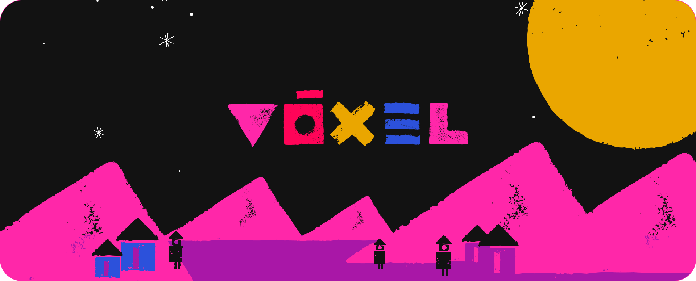

# Vóxel Estudio

    

Estudio boutique de diseño para startups con visión estratégica.

## 🚀 Enfoque

En Vóxel Estudio **ayudamos a startups y empresas tecnológicas a construir una presencia sólida y profesional.** Colaboramos en la creación de plataformas, apps y experiencias digitales completas, trabajando junto a fundadores, equipos técnicos y product managers.

## Qué ofrecemos

- **Identidad Visual**
  Desarrollamos marcas y sistemas gráficos completos alineados con la personalidad y visión de nuestros clientes.
  
- **Presentación institucionales, brochures de servicios y pitch decks**  
  Narrativas claras, visuales potentes y estructuras que conectan con inversores, usuarios y aliados.
  
- **Diseño UX/UI para MVPs y productos en evolución**  
  Interfaces funcionales con fuerte orientación al usuario y documentación lista para desarrollo.
  
- **Documentación estratégica para founders**  
  Plantillas de contratos, presupuestos, manuales de identidad y documentación institucional.

- **Gestión eficiente de procesos**  
  Trabajamos de forma flexible, adaptada a cada cliente. Generamos documentación clara de cada paso.

## Cómo trabajamos

En Vóxel Estudio combinamos experiencia, método y sensibilidad visual para acompañar a *startups* y equipos *tech* en cada etapa del diseño. Nuestro enfoque se basa en:

- **Colaboración directa con founders y equipos técnicos**  
    Nos integramos al proceso desde el inicio, entendiendo el contexto del producto, sus usuarios y objetivos estratégicos. Co-creamos soluciones visuales que fortalecen la narrativa institucional y la propuesta de valor.
    
- **Iteración ágil con entregables claros**  
    Trabajamos en ciclos cortos, con entregables validados en cada etapa. Esto permite ajustar, escalar y documentar decisiones sin perder ritmo ni foco.
    
- **Documentación modular y replicable**  
    Cada proyecto incluye documentación lista para compartir con inversores, desarrolladores o aliados estratégicos. Usamos formatos estandarizados que facilitan la implementación y el versionado.
    
- **Auditoría visual y conceptual**  
    Evaluamos marcas existentes, detectamos inconsistencias y proponemos mejoras alineadas con la identidad deseada. Aplicamos matrices de decisión, benchmarking visual y grillas de aplicación para justificar cada elección.
    
- **Adaptabilidad y foco en resultados**  
    Nos adaptamos al ritmo y necesidades de cada cliente, priorizando la claridad, la diferenciación y la eficiencia en cada entrega.
    

---

## Contacto

> ¿Tenés una idea y querés presentarla con precisión?  
> 📩 info@voxel.com.ar
> 🌐 [voxel.com.ar](https://voxel.com.ar)

---

> _"Diseñamos para que las ideas se conecten y evolucionen."_