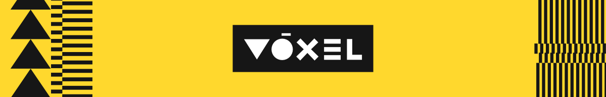

# Vóxel Estudio

    

> Estudio creativo de branding para startups y empresas tecnológicas con visión estratégica.

## Enfoque

En Vóxel Estudio **ayudamos a startups, empresas tecnológicas e industriales a construir una presencia sólida y profesional.** Colaboramos en la creación de plataformas, apps y experiencias digitales completas, trabajando junto a fundadores, equipos técnicos y product managers.

## Qué ofrecemos

- **Identidad Visual**
  Desarrollamos marcas y sistemas gráficos completos alineados con la personalidad y visión de nuestros clientes.
  
- **Presentación institucionales, brochures de servicios y pitch decks**  
  Narrativas claras, visuales potentes y estructuras que conectan con inversores, usuarios y aliados.
  
- **Diseño UX/UI para MVPs y productos en evolución**  
  Interfaces funcionales con fuerte orientación al usuario y documentación lista para desarrollo.
  
- **Documentación estratégica para founders**  
  Plantillas de contratos, presupuestos, manuales de identidad y documentación institucional.

- **Gestión eficiente de procesos**  
  Trabajamos de forma flexible, adaptada a cada cliente. Generamos documentación clara de cada paso.

---
## Contacto

> ¿Tenés una idea y querés presentarla con precisión?  
> 📩 info@voxel.com.ar
> 🌐 [voxel.com.ar](https://voxel.com.ar)